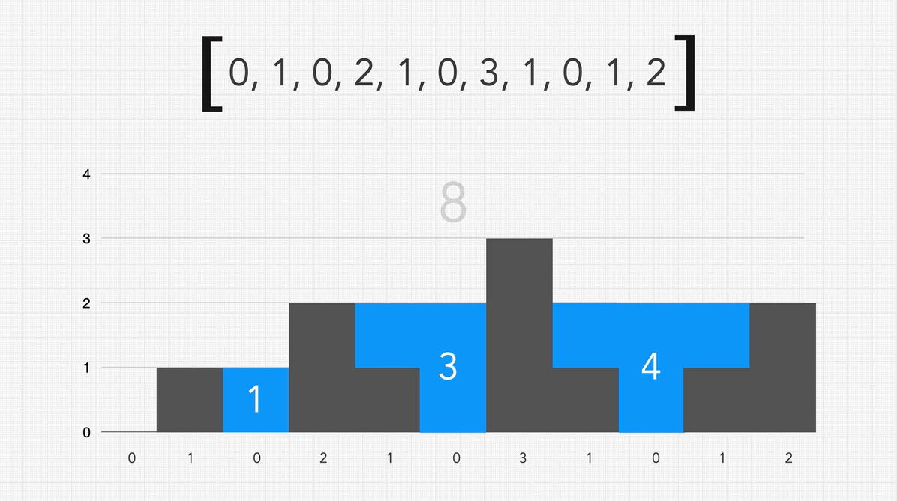

## Question 🤔
Given an Integer array representing an elevation map where the width of each bar is 1,
return how much rainwater can be trapped.

Example 
>***Int[] arr = [0, 1, 0, 2, 1, 0, 3, 1, 0, 1, 2]***

Return 

>***return 8***

## Solution 🙋

  
Click here to expand the solution

#### First we solve this with brute force way which takes O(n^2) time and O(n) space complexities.
* Here we calculate the water that we can hold in a current column/pile at a time.
* To do that we are going to the left and right separately and find the maximum height in each side.
* Then get the minimum of both `maxLeft` and `maxRight`, and subtract it by the current column/pile height.
* The formula behind the logic is `waterInCurrentPile = Math.min(maxLeft, maxRight) - arr.get(i);`

#### Then the optimal solution using **Two Pointers Technique** with the O(n) time and O(1) space complexities.
* Identify pointer with lesser value
* Is this pointer value less than or equal to the max on that side
  * Yes - Update max on that side
  * No - get water for pointer value and add it to the total
* move pointer to inward/backward
* repeat above until both pointers are met

[//]: # (adding additional margin from bottom)
 
 
 
 

