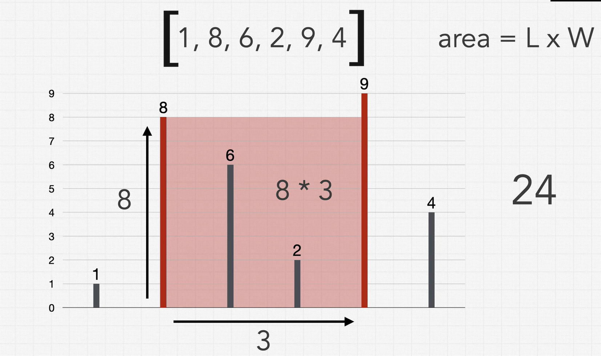

## Question 🤔
You are given an array of positive integers where each integer represents the height of a 
vertical line on a chart. Find two lines which together with the x-axis forms a container that 
would hold the greatest amount of water. Return the area of water it would holod.

Example 
>***Int[] arr = [1, 8, 6, 2, 9, 4]***

Return 

>***return 24***

## Solution 🙋

  
Click here to expand the solution

* First we solve this with brute force way which takes O(n^2) time and O(1) space complexities.
* Then the optimal solution using **Two Pointers Technique** with the O(n) time and O(1) space complexities.

[//]: # (adding additional margin from bottom)
 
 
 
 

